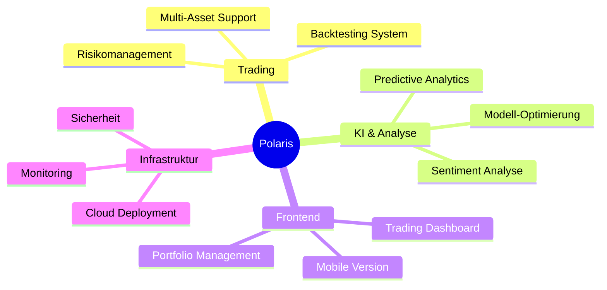

# Polaris Platform

## Übersicht

Polaris ist eine fortschrittliche Platform für automatisiertes Trading, die Marktdaten und Nachrichtenanalyse kombiniert. Das System besteht aus vier Hauptkomponenten: einer Datenpipeline für die Sammlung und Verarbeitung von Handelsdaten, einem KI-Analysemodul für fortgeschrittene Marktanalysen, einem Trading-API-Server für die Handelsausführung und einem Frontend für die Benutzerinteraktion.

## Roadmap & Entwicklung



### Aktuelle Prioritäten

-   🎯 Backtesting Framework & Validierung
-   🔒 Sicherheitsinfrastruktur
-   📊 Trading Dashboard
-   🤖 KI-Modell-Optimierung

### In Entwicklung

-   🚀 Cloud Infrastructure
-   📡 Daten-Pipeline
-   🔐 Basis-Sicherheit
-   📱 Mobile Support

## Hauptfunktionen

-   🔄 Echtzeit-Marktdaten-Collection
-   📰 News-Aggregation und Sentiment-Analyse
-   🧠 KI-basierte Datenanalyse mit Deepseek 1.3B
-   📊 Datenaufbereitung und -speicherung
-   🔒 Sichere Datenverwaltung
-   🌐 Moderne Web-Oberfläche
-   🤖 Automatisierte Handelsausführung

## Technologie-Stack

-   **Programmiersprache:** Python, TypeScript
-   **Datenverarbeitung:** Pandas, NumPy
-   **KI/ML:** PyTorch, Deepseek 1.3B
-   **Datenbank:** PostgreSQL/TimescaleDB
-   **Frontend:** React + Vite
-   **Backend:** Python (FastAPI)
-   **Containerisierung:** Docker
-   **Cloud:** AWS (in Planung)

## Projektstruktur

```
polaris/
├── trading-data-pipeline/      # Datensammlung und -verarbeitung
│   ├── src/
│   │   ├── data_collection/   # Markt- und Newsdaten-Sammlung
│   │   ├── data_processing/   # Datenverarbeitung
│   │   ├── storage/          # Datenbankoperationen
│   │   └── utils/            # Hilfsfunktionen
│   ├── requirements.txt      # Python-Abhängigkeiten
│   └── .env                 # Umgebungsvariablen
│
├── trading-ai-analysis/       # KI-Analysekomponente
│   ├── src/
│   │   ├── models/           # KI-Modelle (Deepseek)
│   │   ├── analysis/         # Analyselogik
│   │   └── utils/            # Hilfsfunktionen
│   ├── requirements.txt      # Python-Abhängigkeiten
│   └── .env                 # Umgebungsvariablen
│
├── trading-api-server/       # Handelsausführung
│   ├── src/
│   │   ├── api/             # API-Endpunkte
│   │   ├── services/        # Geschäftslogik
│   │   └── utils/           # Hilfsfunktionen
│   ├── requirements.txt     # Python-Abhängigkeiten
│   └── .env                # Umgebungsvariablen
│
└── trading-frontend/        # Benutzeroberfläche
    ├── src/
    │   ├── components/      # React-Komponenten
    │   ├── services/        # API-Integration
    │   └── utils/           # Hilfsfunktionen
    ├── package.json        # Node.js-Abhängigkeiten
    └── .env               # Umgebungsvariablen
```

## Lizenz

Proprietär - Alle Rechte vorbehalten

---

⚠️ **Hinweis:** Dieses System ist für den professionellen Einsatz gedacht. Beachten Sie alle rechtlichen und regulatorischen Anforderungen in Ihrer Jurisdiktion.
