# Polaris Platform

## Übersicht

Polaris ist eine fortschrittliche Platform für automatisiertes Trading, die Marktdaten und Nachrichtenanalyse kombiniert. Das System besteht aus vier Hauptkomponenten: einer Datenpipeline für die Sammlung und Verarbeitung von Handelsdaten, einem KI-Analysemodul für fortgeschrittene Marktanalysen, einem Trading-API-Server für die Handelsausführung und einem Frontend für die Benutzerinteraktion.

## Hauptfunktionen

-   🔄 Echtzeit-Marktdaten-Collection
-   📰 News-Aggregation und Sentiment-Analyse
-   🧠 KI-basierte Datenanalyse mit Deepseek 1.3B
-   📊 Datenaufbereitung und -speicherung
-   🔒 Sichere Datenverwaltung
-   🌐 Moderne Web-Oberfläche
-   🤖 Automatisierte Handelsausführung

## Technologie-Stack

-   **Programmiersprache:** Python, TypeScript
-   **Datenverarbeitung:** Pandas, NumPy
-   **KI/ML:** PyTorch, Deepseek 1.3B
-   **Datenbank:** PostgreSQL/TimescaleDB
-   **Frontend:** React + Vite
-   **Backend:** Python (FastAPI)
-   **Containerisierung:** Docker
-   **Cloud:** AWS (in Planung)

## Projektstruktur

```
polaris/
├── trading-data-pipeline/      # Datensammlung und -verarbeitung
│   ├── src/
│   │   ├── data_collection/   # Markt- und Newsdaten-Sammlung
│   │   ├── data_processing/   # Datenverarbeitung
│   │   ├── storage/          # Datenbankoperationen
│   │   └── utils/            # Hilfsfunktionen
│   ├── requirements.txt      # Python-Abhängigkeiten
│   └── .env                 # Umgebungsvariablen
│
├── trading-ai-analysis/       # KI-Analysekomponente
│   ├── src/
│   │   ├── models/           # KI-Modelle (Deepseek)
│   │   ├── analysis/         # Analyselogik
│   │   └── utils/            # Hilfsfunktionen
│   ├── requirements.txt      # Python-Abhängigkeiten
│   └── .env                 # Umgebungsvariablen
│
├── trading-api-server/       # Handelsausführung
│   ├── src/
│   │   ├── api/             # API-Endpunkte
│   │   ├── services/        # Geschäftslogik
│   │   └── utils/           # Hilfsfunktionen
│   ├── requirements.txt     # Python-Abhängigkeiten
│   └── .env                # Umgebungsvariablen
│
└── trading-frontend/        # Benutzeroberfläche
    ├── src/
    │   ├── components/      # React-Komponenten
    │   ├── services/        # API-Integration
    │   └── utils/           # Hilfsfunktionen
    ├── package.json        # Node.js-Abhängigkeiten
    └── .env               # Umgebungsvariablen
```

## Roadmap

```mermaid
mindmap
  root((Polaris Platform))
    Infrastruktur
      Cloud Deployment
        AWS Setup
        Skalierbarkeit
        Load Balancing
      Monitoring System
        Performance Tracking
        Alerting
        Logging
      Backup & Recovery
        Automatische Backups
        Disaster Recovery
        Datenreplikation
    Trading System
      Backtesting
        Historische Daten
        Strategie-Tests
        Performance-Analyse
      Strategien
        Multi-Asset Trading
        Portfolio-Optimierung
        Risikomanagement
      Performance
        Latenzoptimierung
        Durchsatzsteigerung
        Ressourceneffizienz
    KI & Analyse
      Modell-Optimierung
        Feintuning
        Hyperparameter
        Validierung
      Sentiment Analyse
        News Integration
        Social Media
        Marktsentiment
      Predictive Analytics
        Zeitreihenanalyse
        Pattern Recognition
        Anomalie-Erkennung
    Frontend
      Dashboard
        Echtzeit-Charts
        Performance-Metriken
        Alerts
      Portfolio Management
        Asset-Übersicht
        Trade-Historie
        Risiko-Metriken
      Mobile Version
        Responsive Design
        Push-Notifications
        Touch-Optimierung
    Sicherheit
      Penetration Testing
        Vulnerability Scans
        Security Audits
        Code Reviews
      Compliance
        Datenschutz
        Regulierung
        Dokumentation
      Zertifizierung
        Sicherheitsstandards
        Best Practices
        Externe Audits
```



## Entwicklungsprioritäten

### Kritische Komponenten

-   🎯 Backtesting Framework & Validierung
-   🔒 Sicherheitsinfrastruktur & Compliance
-   📊 Kernfunktionen des Trading-Dashboards
-   ⚡ Performance-Optimierung der Trading-Engine

### Wichtige Erweiterungen

-   🤖 KI-Modell-Verbesserungen & Validierung
-   📱 Mobile Unterstützung & Responsive Design
-   🌐 Multi-Exchange-Integration
-   📈 Erweiterte Analysetools & Reporting

### Zusätzliche Features

-   🔄 Automatische Strategie-Optimierung
-   🤝 Social Trading & Community Features
-   🌍 Internationalisierung & Lokalisierung
-   🎨 UI/UX-Verfeinerungen

### In Entwicklung

-   🚀 Cloud Infrastructure Setup
-   📊 Dashboard Grundfunktionen
-   🔐 Basis-Sicherheitsfunktionen
-   📡 Daten-Pipeline-Erweiterungen

## Lizenz

Proprietär - Alle Rechte vorbehalten

---

⚠️ **Hinweis:** Dieses System ist für den professionellen Einsatz gedacht. Beachten Sie alle rechtlichen und regulatorischen Anforderungen in Ihrer Jurisdiktion.
